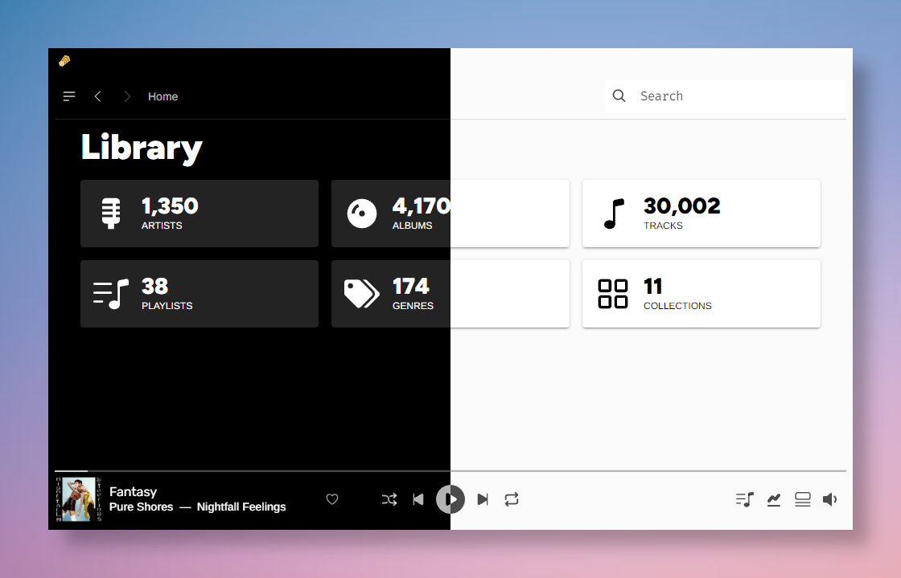
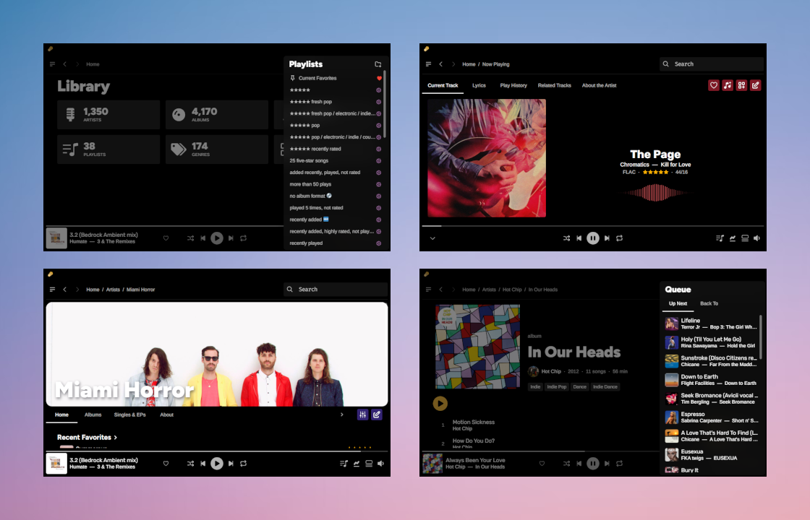

# Hex Music Player

<b>Hex Music Player</b> is a cross-platform desktop music player for Plex Media Server, built with <b>React</b>, <b>Electron</b>, and the <b>Web Audio API</b> for gapless audio playback. The goal of the project is a feature-complete replacement for the Plex Web client for personal music management and playback, while creating a clean, accessible interface that spotlights your personal music collection.
<b>Gapless Audio · Metadata Editing · Library Management</b>

## Screenshots

